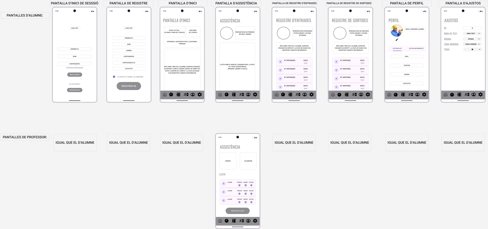

# A05-4-ProjecteGuiat

Part de DAM
=================
8/11/2024
He fet el prototip de baixa fidelitat del wireframe de l'aplicació mòbil, on el resultat és el següent:

Link al FIGMA on hi és el wireframe: https://www.figma.com/design/titMMVK4P7uRwgsF8lLiD1/Projecte-Wireframe-m%C3%B2bil?node-id=0-1&t=XUgyCn0NGMQxcwQF-1

Ho he separat en dos parts: pantalles d'alumne i pantalles de professorat (l'administrador pot veure tant les de l'alumne com les de professor)
Les pantalles són:
1) Pantalla d'inici de sessió: demana a l'usuari l'ID, el nom i la contrassenya, llavors clica el botó d'iniciar sessió. Si no té compte ha de registrar-se amb el botó de registrar-se.
2) Pantalla de registre: Demana a l'usuari les seves dades, i llavors l'usuari ha d'acceptar el termini i les condicions i clicar-li al botó de registrar-se.
3) Pantalla d'inici: Mostra diverses informacions: si està fora o dins de l'edifici, els dies dins de l'edifici i informaió respectiva amb les dades de l'usuari, les entrades i sortides que ha fet i quan les ha fet.
4) Pantalla d'assistència:
    Alumnat: Mostra el percentatge de present, retard i absent en la part superior, i a la part inferior mostra una llista amb el nom de l'assignatura, la data  i el tipus d'assistència.
    Professorat: Mostra l'horari i el calendari a la part superior, i a la part inferior mostra la llista amb els alumnes, per indicar si són presents, tenen retard o són absents, amb una opció de modificar llista per si hi ha canvis.
5) Pantalla de registre d'entrades: Mostra el percentatge d'entrades fetes a la part superior, i a la part inferior una llista amb el número d'entrades que ha fet i la data en quan les ha fet.
6) Pantalla de registre de sortides: Mostra el percentatge de sortides fetes a la part superior, i a la part inferior una llista amb el número de sortides que ha fet i la data en quan les ha fet.
7) Pantalla de perfil: Mostra l'icona amb el nom a la part superior, i a la part inferior dades de l'usuari, en que hi ha l'opció per editar-les.
8) Pantalla d'ajustos: Mostra certes opcions que té l'usuari, que pot canviar si ho necessita.

Part de DAW
======================
8/11/2024
He fet 3 pàgines diferents per a la pàgina web. Cadascuna es diferent i es una vista per als 3 membres demanats; l'administrador, l'alumne i el professor. Cadascú te les seves funcions úniques i un rol diferent.
Totes les pàgines segueixen el mateix patró, amb la barra lateral esquerra amb la vista general i els usuaris en línia i també opcions de configuració i sortir. A la dreta està l'apartat de l'usuari amb les seves tasques. Al mitg el contingut de l'usuari en concret.

La primera pàgina es la de l'administrador. Aquest té tot el poder possible i te molte funcions com per exemple accedir a les estadístiques generals, el rendiment dels alumnes, la seva assistència, assignació de grups, canvis d'horari, permisos.

En quant a la vista alumne surt el calendari del curs i informació de l'alumne com el nom, la matrícula, el curs. A la barra lateral esquerra apareixen els companys en línia. També hi han 3 opcions com la assistència, els horaris i els avisos.

I per últim la vista professor, el qual té les funcions de passar la llista amb la opció de marcar presents, absents o retards, modificar l'assistència. Tot això sent diferent per a cada alumne ja qu el professor pot seleccionar cada alumne amb els paràmetres dessitjats.

